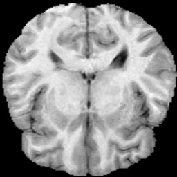
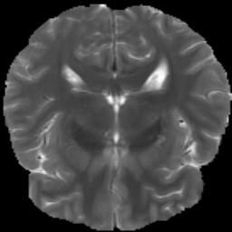

# DATASET
Datasets are brain MRI images consisting of 4 scans.

4 scans were co-registered(paired data).

We used **300 "T1 & T2" images**.

Dataset can be downloaded in [[link]](https://drive.google.com/drive/folders/1HqEgzS8BV2c7xYNrZdEAnrHk7osJJ--2). (Task01_BrainTumour.tar)

    data
    ├── train
    │     ├──── BRATS_001.nii.gz
    │     ├──── BRATS_002.nii.gz
    │     ├──── BRATS_003.nii.gz
    │     ├──── ...
    │
    └── val
          ├──── BRATS_501.nii.gz
          ├──── BRATS_502.nii.gz
          ├──── BRATS_503.nii.gz
          ├──── ...
    
# Training
Input Size : 256x256

Batch Size : 4

Number of epoch / iteration : 300 / 25

Number of downsampling / residual blocks : 2 / 4

**Loss Weight :**

**- (1) GAN Loss : 10**
  
**- (2) VAE Reconstruction Loss : 100**
  
**- (3) VAE Regularization(D_KL) Loss : 0.1**
  
**- (4) Cycle-consistency Reconstruction Loss : 100**


# Result
## Task A : T1 -> T2

| T1                            | T1->T2                        | T2                            | histogram                     |
| ----------------------------- | ----------------------------- | ----------------------------- | ----------------------------- |
|    |    |    |    |

## Task B : T2 -> T1

| T2                            | T2->T1                        | T1                            | histogram                     |
| ----------------------------- | ----------------------------- | ----------------------------- | ----------------------------- |
|    |    |    |    |


# Run Example
```
$ cd code/5_UNIT
$ python3 unit.py
```


