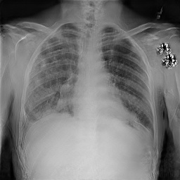

# DATASET
Datasets are X-ray images classified into two classes.(Normal / Lung Opacity)

Out of 26,684 images, 5,000 images were randomly selected for each class.(**training set**)

And 40 images were randomly selected for each class.(**validation set**)

Dataset can be downloaded in [[link]](https://www.kaggle.com/c/rsna-pneumonia-detection-challenge/data). (RSNA pneumonia detection challenge)

    data
    ├── train
    │     ├──── normal
    │     │        ├──── normal_0001.jpg
    │     │        ├──── normal_0002.jpg
    │     │        ├──── normal_0003.jpg
    │     │        ├──── ...
    │     │
    │     └──── lung_opacity
    │              ├──── opacity_0001.jpg
    │              ├──── opacity_0002.jpg
    │              ├──── opacity_0003.jpg
    │              ├──── ...
    │
    └── val
          ├──── normal
          │        ├──── normal_5001.jpg
          │        ├──── normal_5002.jpg
          │        ├──── normal_5003.jpg
          │        ├──── ...
          │
          └──── lung_opacity
                   ├──── opacity_5001.jpg
                   ├──── opacity_5002.jpg
                   ├──── opacity_5003.jpg
                   ├──── ...
    
# Training
Input Size : 256x256

Batch Size : 6

Number of epoch / iteration : 100 / 600

Number of downsampling / residual blocks : 2 / 4

content dimension / style dimension : 64 / 8

**Loss Weight :**

**- (1) GAN Loss : 1**
  
**- (2) Image Reconstruction Loss : 10**
  
**- (3) Latent Reconstruction Loss : 1**
  
**- (4) Cycle-consistency Reconstruction Loss : No Use Cycle-consistency Loss**


# Result
## Task A : Normal -> Lung Opacity

| original(Normal)      | result_1                     | result_2                      | result_3                      | result_4                      | 
| --------------------------- | --------------------------- | --------------------------- | --------------------------- | --------------------------- |
|       |    |   |    |    |

## Task B : Lung Opacity -> Normal

| original(Lung Opacity)| result_1                      | result_2                      | result_3                      | result_4                      | 
| --------------------------- | --------------------------- | --------------------------- | --------------------------- | --------------------------- |
|       |    |   |    |    |


# Run Example
```
$ cd code/006_MUNIT
$ python3 munit.py
```


