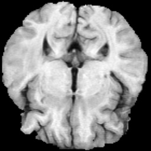
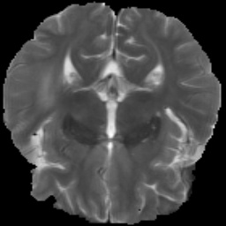

# DATASET
Datasets are brain MRI images consisting of 4 scans.

4 scans were co-registered(paired data).

We used **300 MRI images** and  **"T1 & T2" images**.

Dataset can be downloaded in [[link]](https://drive.google.com/drive/folders/1HqEgzS8BV2c7xYNrZdEAnrHk7osJJ--2). (Task01_BrainTumour.tar)


# Result
## Task A : T1 -> T2

| T1                            | T1->T2                        | T2                            | histogram                     |
| ----------------------------- | ----------------------------- | ----------------------------- | ----------------------------- |
|    |    |    |    |

## Task B : T2 -> T1

| T2                            | T2->T1                        | T1                            | histogram                     |
| ----------------------------- | ----------------------------- | ----------------------------- | ----------------------------- |
|    |    |    |    |


# Run Example
```
$ cd code/5_CycleGAN
$ python3 cyclegan.py
```


